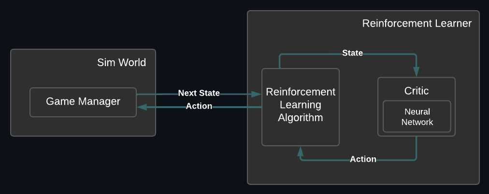

# Reinforcement Learning using Sarsa Algorithm

## Description

A reinforcement learning system using the Sarsa RL Algorithm for learning to play a simple physics game. The AI has been trained to play a game, which we here will refer to as the *The Acrobat Game*. The acrobat game is a simulated game designed to approximate an acrobat holding on to a horizontal bar using their hands.

### Architecture

The RL system consists of a Critic implemented using a neural network and the Sarsa algorithm itself, which handles the actual learning and communication with the simulation world. The diagram below shows the structure of the Sarsa RL system:



### Simulation World 
The acrobat world consists of two line segments representing rods. The upper rod is attached to a pivot point at its upper end and can rotate freely around this point. The lower and upper rods are connected tip to tip in another pivot point and allows movement and rotation of the lower rod.

At any given time, the actor has three possible actions: It can apply a rightward or leftward force at the lower pivot, or it can choose to do nothing.

The actor’s goal is to apply forces to the pivot point in such a way that the tip of the lower rod reaches a certain height above the upper pivot point indicated by a dotted line.

## Usage

To run this program, download or clone the repository and run main.py using Python 3.9 or higher.

## Requirements

* Python 3.9 or higher
* Tensorflow
* Numpy
* Matplotlib

```
pip install tensorflow numpy matplotlib
```

## Results

The AI's performance before any training:


After training:


